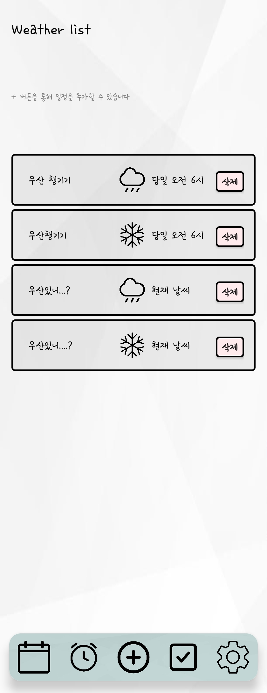

🌦️ Triplan (트리플랜)

날씨 정보와 캘린더를 하나로! 일상 속 일정 관리를 돕는 안드로이드 올인원 플래너

📖 Project Overview (프로젝트 개요)

Triplan은 메모장, 캘린더, 날씨 정보가 분산되어 있는 불편함을 해소하기 위해 개발된 통합 일정 관리 애플리케이션입니다.
사용자가 선택한 날짜와 지역의 실시간 날씨 정보를 캘린더와 함께 제공하여, 날씨 변화에 맞춰 효율적으로 일정을 계획할 수 있도록 돕습니다.

개발 기간: 2024.09 ~ 2024.12 (15주)

개발 인원: 3명 (팀 프로젝트)

주요 역할: PM(팀장), Room Database 설계 및 구축, 날씨 조건별 알림 시스템(WorkManager) 구현, API 데이터 필터링 로직

🛠 Tech Stack (기술 스택)

|Category|Stack|
|------|:---:|
|Language|Java|
|Framework|Android Studio|
|Database|Room Database|
|API|OpenWeatherMap API|
|Notion|https://www.notion.so/PROJECT-124af15a1ef28080a988f1517b2044ad|

Key Features (핵심 기능)

1. 📅 날씨 연동 스마트 캘린더

기능: 캘린더에서 날짜를 선택하면 해당 날짜의 **날씨 예보(3시간 간격, 최대 5일)**를 하단 스크롤바에서 즉시 확인 가능

구현: 사용자가 선택한 지역(Location)과 날짜(Date) 데이터를 기반으로 OpenWeatherAPI 데이터를 필터링하여 매칭

2. 📝 직관적인 일정 관리 (CRUD)

기능: 캘린더 날짜를 더블 클릭하여 간편하게 일정 추가, 수정, 삭제

구현: RoomDB를 활용하여 로컬 데이터베이스에 일정 데이터를 저장하고, 캘린더 UI에 실시간으로 반영 (일정이 있는 날짜는 밑줄 표시)

3. ✅ 주기별 체크리스트 (Habit Tracker)

기능: 매일, 매주, 매월 반복되는 루틴을 관리하는 체크리스트

구현: SharedPreference 또는 DB를 활용하여 설정한 주기가 지나면 체크박스가 자동으로 초기화되도록 로직 구현

4. 🔔 날씨 맞춤형 알림

기능: 사용자가 설정한 날씨 조건(예: 비 오는 날)과 시간에 맞춰 푸시 알림 전송

구현: 백그라운드 워커(Worker)를 통해 API 데이터를 주기적으로 확인하고 조건 충족 시 시스템 알림 트리거

🚀 Trouble Shooting & Learnings (트러블 슈팅 및 배운 점)

1. API 데이터 구조화 및 필터링 문제

문제 상황: OpenWeatherAPI에서 넘어오는 방대한 JSON 데이터 중, 특정 날짜와 시간의 데이터만 추출하여 UI에 매핑하는 과정에서 로직 복잡도가 증가함.

해결:

데이터를 효율적으로 처리하기 위해 DTO(Data Transfer Object) 패턴을 적용하여 필요한 필드(온도, 날씨 아이콘, 강수 확률)만 파싱.

날짜별 데이터 그룹화 로직을 개선하여 스크롤 뷰 렌더링 속도 최적화.

2. 데이터베이스 연동 및 버전 호환성 (RoomDB)

문제 상황: 프로젝트 초기, 처음 접해보는 Room Database 연동 작업 중 지속적인 빌드 오류와 연결 실패 현상이 발생하여 개발 진행에 난항을 겪음.

해결 및 결과:

여러 차례의 시행착오와 로그 분석을 통해, 단순 코드 오류가 아닌 라이브러리 간의 버전 호환성(Dependency Conflict) 문제임을 파악함.

호환 가능한 안정적인 버전으로 의존성을 변경하여 정상적으로 연동에 성공하였으며, 이 과정을 통해 외부 라이브러리 사용 시 버전 관리의 중요성을 깊이 이해하게 됨.

📂 Project Structure (패키지 구조)

com.example.triplan
├── activity       # 액티비티 (화면 로직)

│   ├── MainActivity.java

│   ├── WeatherActivity.java

│   └── SettingActivity.java

├── adapter        # 리사이클러뷰 어댑터

├── database       # RoomDB Entity & DAO

├── network        # Retrofit API Interface

└── utils          # 유틸리티 클래스
